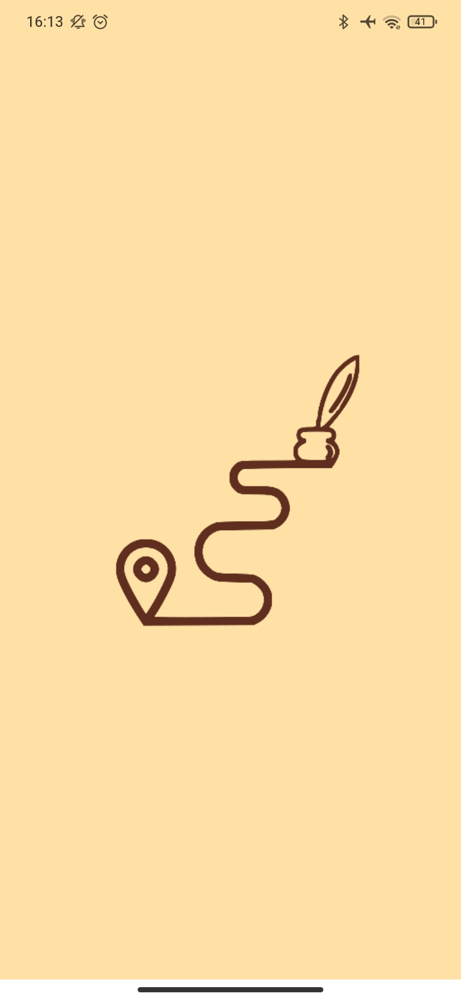
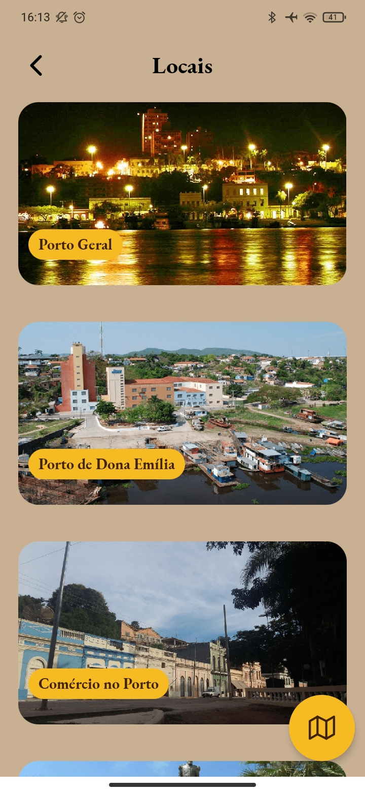
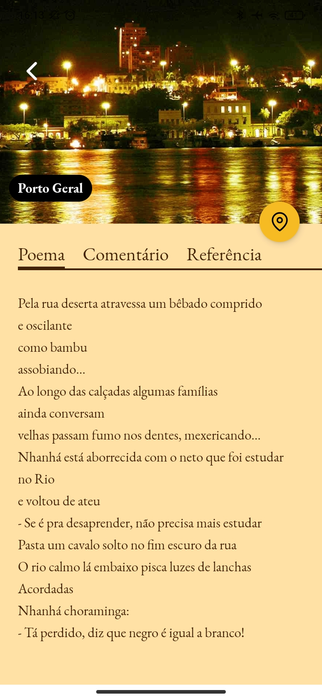
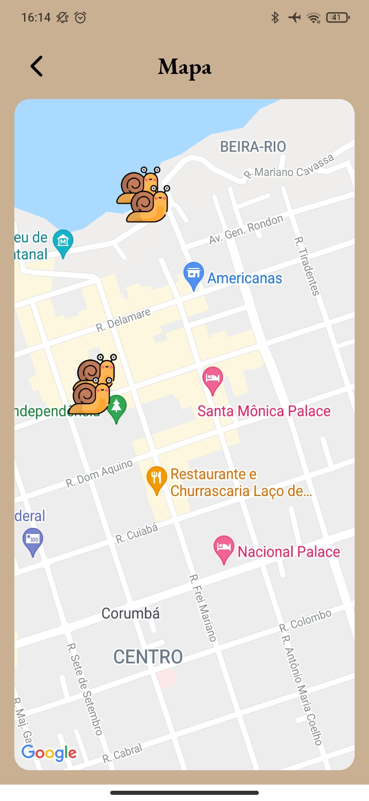

<h1 align="center">
    
</h1>

<h1 align="center">
  Trilhas Poéticas
</h1>

<p align="center">
 

  
</p>

<p align="center">
  <a href="#-tecnologias">Tecnologias</a>&nbsp;&nbsp;&nbsp;|&nbsp;&nbsp;&nbsp;
  <a href="#-projeto">Projeto</a>&nbsp;&nbsp;&nbsp;|&nbsp;&nbsp;&nbsp;
  <a href="#instalação">Instalação</a>
</p>

## 🚀 Tecnologias

Esse projeto foi desenvolvido com as seguintes tecnologias:

- [React Native](https://facebook.github.io/react-native/)
- [Expo](https://expo.io/)

## 💻 Projeto
**Trilhas Poéticas é um projeto criado para listar locais de uma cidade referenciados por um autor. Um projeto para entusiastas e curiosos da cultura de uma região.**

## Instalação
### Pré requisitos
Ter instalado:
- [Node](https://nodejs.org/en/download/)
- [Yarn](https://classic.yarnpkg.com/en/docs/install/)
- [Expo](https://docs.expo.dev/get-started/installation/)


### No terminal, rodar
```sh
# Clonar repositório
git clone https://github.com/andre23arruda/trilhas-poeticas

# Entrar na pasta dos arquivos
cd trilhas-poeticas

# Instalar os pacotes do projeto
yarn install

# Rodar
expo start
```

### Rodar expo no celular
- Abrir expo no celular
- Ler QR code e executar o app

<div align="center">
    
    
    
</div>
<p align="center">Splash Screen, Author and Places</p>
<hr>

<div align="center">
    
    
</div>
<p align="center">Place detail and Map</p>
<hr>

## 🚧 Em breve
Instruções em como colaborar com o projeto e fazer em sua cidade.
